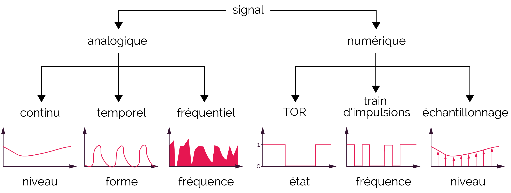

# 1. Introduction à l'Électronique

## Définition de l'électronique

L'électronique est une branche de la physique appliquée qui se concentre sur l'étude, la conception, et l'utilisation des composants et circuits permettant de **contrôler le flux des charges électriques**. Elle s'intéresse principalement à l'utilisation de ces charges pour manipuler des informations, amplifier des signaux, et créer des systèmes intelligents.

Contrairement à l'électricité, qui s'occupe de la production et de la distribution de l'énergie, l'électronique se concentre sur les **applications de faible puissance**, où les signaux électriques sont manipulés pour des tâches spécifiques, comme le traitement des données ou le contrôle des systèmes.

- **Exemple d'application de l'électronique** : Les téléphones mobiles, les ordinateurs, les téléviseurs, les systèmes de contrôle industriel, et les dispositifs médicaux tels que les pacemakers, font tous appel à l'électronique pour fonctionner.

L’électronique peut être subdivisée en plusieurs branches, dont les plus courantes sont :

- **L’électronique analogique** : Utilise des signaux continus.

- **L’électronique numérique** : Utilise des signaux discrets (0 et 1).

  
  

## Historique de l’électronique

L’histoire de l’électronique est un vaste domaine qui s’étend sur plus d’un siècle, marquée par des avancées clés qui ont permis l'essor des technologies modernes.

1. **Les débuts de l'électronique (XIXe siècle)** :
   
   - **La diode à vide** (1904) : John Ambrose Fleming a inventé la première diode à vide, un dispositif qui permettait de faire circuler un courant électrique dans une seule direction. Cela a ouvert la voie à la radio et à d'autres formes de communication sans fil.
   
   

    
    

   

   

    
    

   

  
   - **La triode** (1906) : Lee De Forest améliora la diode à vide en y ajoutant une électrode de contrôle pour créer la triode, qui pouvait amplifier les signaux. C'était un composant essentiel dans les systèmes de communication.
   
   

    
    

   

2. **L’invention du transistor (1947)** :
   
   - Le **transistor**, inventé par **John Bardeen**, **Walter Brattain** et **William Shockley**, est considéré comme l’une des plus grandes avancées de l’histoire de l’électronique. Il a permis de remplacer les tubes à vide encombrants par des dispositifs compacts et fiables, ouvrant ainsi la voie à la miniaturisation des appareils électroniques.
   - Le transistor est la pierre angulaire des circuits modernes, utilisé comme **commutateur** ou **amplificateur**.

   

    
    

   

   

    
    

   

3. **L’apparition des circuits intégrés (années 1960)** :
   
   - Le **circuit intégré (CI)**, mis au point par **Jack Kilby** et **Robert Noyce**, a permis d’intégrer des milliers de transistors et autres composants sur une seule puce de silicium. Cela a conduit à l'informatique moderne et à la révolution numérique.
   - Les circuits intégrés ont permis de développer des **ordinateurs personnels**, des **microprocesseurs**, et des systèmes électroniques complexes que l’on retrouve dans presque tous les appareils électroniques modernes.

   

    
    

   

4. **Les systèmes embarqués et l'électronique actuelle** :
   
   - Aujourd'hui, l'électronique est au cœur de presque toutes les technologies modernes. Des systèmes embarqués (comme les microcontrôleurs) aux dispositifs portables et à l'intelligence artificielle, l'électronique continue d'évoluer pour rendre nos appareils plus intelligents, plus petits, et plus puissants.
   - Des domaines comme l’**Internet des objets (IoT)** et l’**intelligence artificielle** sont devenus des sujets d’étude majeurs dans le développement futur de l’électronique.
   
   

    
    

   

## Différences entre l’électronique analogique et numérique

L’électronique est généralement classée en deux grandes catégories : **l’électronique analogique** et **l’électronique numérique**. Ces deux branches se différencient par la manière dont elles traitent les **signaux électriques**.

1. **Électronique analogique**

   Les signaux analogiques sont des **signaux continus** qui peuvent prendre n’importe quelle valeur dans une plage donnée. Ils sont utilisés dans des applications où les variations continues de l’information sont importantes, comme dans les systèmes audio ou radio.

   - **Exemple d’un signal analogique** : Une onde sonore transformée en un signal électrique via un microphone. Ce signal est ensuite amplifié et transmis dans des haut-parleurs.
   - **Composants utilisés** :
   
     - **Transistors** : Pour amplifier les signaux.
     - **Amplificateurs opérationnels** : Utilisés pour amplifier ou manipuler des signaux continus.
     - **Condensateurs et inductances** : Pour le filtrage et le stockage d’énergie.
   
   - **Applications** : Amplificateurs audio, radio FM, télévision analogique, instruments de mesure.

   **Avantages** :
   
   - Réponse directe aux signaux continus, ce qui les rend parfaits pour le traitement de signaux naturels comme le son, la lumière, et la température.

   **Inconvénients** :
   
   - Les signaux analogiques sont sensibles au bruit et aux interférences, ce qui peut altérer la qualité du signal.

2. **Électronique numérique**

   Les signaux numériques, quant à eux, sont **discrets**. Ils ne prennent que deux valeurs possibles, généralement représentées par **0 et 1**. Cette nature binaire fait de l'électronique numérique la base des ordinateurs et des systèmes de traitement de données.

   - **Exemple d’un signal numérique** : Un signal binaire utilisé pour transmettre des données dans un ordinateur. Chaque "bit" représente soit un 0, soit un 1.
   - **Composants utilisés** :
   
     - **Portes logiques (AND, OR, NOT)** : Pour effectuer des opérations logiques sur des bits.
     - **Microprocesseurs** : Cerveaux des ordinateurs et des systèmes numériques.
     - **Flip-flops et registres** : Utilisés pour stocker des bits d’informations.
   - **Applications** : Ordinateurs, téléphones portables, systèmes embarqués, réseaux numériques.

   **Avantages** :
   
   - Moins sensibles au bruit, et la capacité à traiter des signaux numériques de manière plus rapide et plus précise.
   - Facile à stocker et à reproduire sans perte d’information, ce qui en fait une technologie idéale pour les systèmes informatiques et de communication.

   **Inconvénients** :
   
   - Complexité accrue lorsqu’il s’agit de traiter des informations continues, nécessitant parfois une **conversion analogique-numérique (CAN)** et **numérique-analogique (CNA)**.

## Comparaison entre l’électronique analogique et numérique

| Aspect                  | Électronique Analogique                               | Électronique Numérique                                  |
|-------------------------|-------------------------------------------------------|--------------------------------------------------------|
| **Nature du signal**     | Continu (variation lisse)                             | Discret (0 ou 1)                                       |
| **Précision du signal**  | Moins précis en présence de bruit                     | Moins sensible au bruit                                 |
| **Applications**         | Audio, radio, télévision, instrumentation             | Ordinateurs, smartphones, systèmes de contrôle          |
| **Coût**                 | Moins coûteux pour des tâches simples                 | Plus coûteux, mais baisse des prix avec la miniaturisation |
| **Composants**           | Transistors, amplificateurs, condensateurs            | Microprocesseurs, portes logiques, mémoires             |
| **Complexité**           | Moins complexe pour des systèmes de base              | Plus complexe pour des systèmes sophistiqués            |
| **Vitesse**              | Moins rapide, dépend de la bande passante des signaux | Très rapide, surtout avec des processeurs modernes      |

## Conclusion

L’électronique, en tant que domaine d’étude et de technologie, est cruciale pour l'évolution des systèmes modernes. La distinction entre **électronique analogique** et **électronique numérique** est essentielle pour comprendre les différentes manières de traiter et de manipuler les signaux électriques.

L'électronique analogique reste importante dans des applications où des signaux continus sont utilisés, comme dans le traitement du son ou les systèmes de mesure, tandis que l'électronique numérique est au cœur des systèmes informatiques, des télécommunications et de l’automatisation industrielle. L’avenir de l’électronique réside dans la convergence de ces deux mondes pour répondre aux besoins toujours croissants de la technologie.