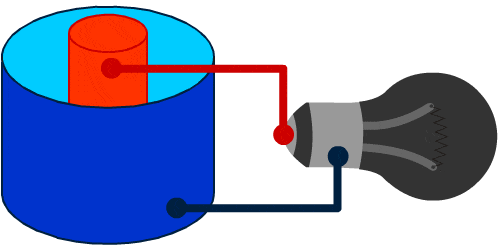
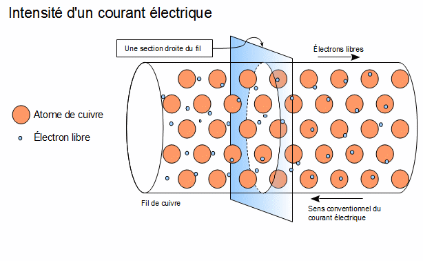
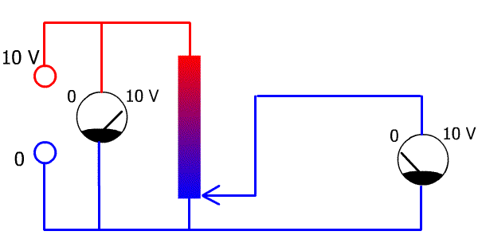
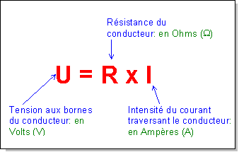
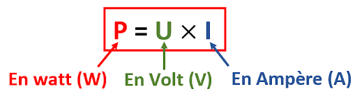

# 2. Notions de Base en Électricité

## Tension (V)

La **tension électrique**, également appelée différence de potentiel ou voltage, représente la force qui pousse les charges électriques à se déplacer dans un circuit. Elle est souvent comparée à la pression exercée par l'eau dans un tuyau : une pression élevée pousse l'eau à travers le tuyau, tout comme une tension élevée pousse les électrons à travers un conducteur.

   

    
    

   

- **Unité de mesure** : La tension est mesurée en **volts (V)**.
- **Symbole** : `V` ou `U` pour la différence de potentiel.
- **Formule** : La tension peut être définie comme l'énergie par unité de charge :  
  `V = W / Q`  
  Où :
  - `V` est la tension (en volts),
  - `W` est le travail ou l'énergie (en joules),
  - `Q` est la charge électrique (en coulombs).

## Courant (I)

Le **courant électrique** est le flux de charges électriques (généralement des électrons) qui se déplacent à travers un conducteur. Le courant peut être comparé au débit d'eau dans un tuyau.

   

    
    

   

  
- **Unité de mesure** : Le courant est mesuré en **ampères (A)**.
- **Symbole** : `I`.
- **Formule** : Le courant est défini comme la charge qui passe par un point dans un circuit par unité de temps :  
  `I = Q / t`  
  Où :
  - `I` est le courant (en ampères),
  - `Q` est la charge (en coulombs),
  - `t` est le temps (en secondes).

## Résistance (R)

La **résistance** est la mesure de l’opposition qu’un matériau offre au passage du courant électrique. Plus la résistance est élevée, plus il est difficile pour le courant de circuler dans le matériau.

   

    
    

   

- **Unité de mesure** : La résistance est mesurée en **ohms (Ω)**.
- **Symbole** : `R`.
- **Formule** : La résistance peut être calculée avec la loi d'Ohm :  
  `R = V / I`  
  Où :
  - `R` est la résistance (en ohms),
  - `V` est la tension (en volts),
  - `I` est le courant (en ampères).

## Loi d'Ohm

   

    
    

   

La **loi d'Ohm** établit une relation directe entre la tension, le courant et la résistance dans un circuit électrique :  
`V = I × R`  
Où :
- `V` est la tension (en volts),
- `I` est le courant (en ampères),
- `R` est la résistance (en ohms).

### Applications de la loi d'Ohm

- Si la résistance augmente, et que la tension reste constante, le courant diminue.
- Si la tension augmente pour une résistance donnée, le courant augmente proportionnellement.

## Puissance (P)

La **puissance électrique** est la vitesse à laquelle l’énergie est consommée ou produite dans un circuit.

   

    
    

   

- **Unité de mesure** : La puissance est mesurée en **watts (W)**.
- **Symbole** : `P`.
- **Formule** : La puissance électrique est donnée par le produit de la tension et du courant :  
  `P = V × I`  
  Où :
  - `P` est la puissance (en watts),
  - `V` est la tension (en volts),
  - `I` est le courant (en ampères).

Il existe une autre formule utile pour calculer la puissance en fonction de la résistance et du courant :  
`P = I² × R`  
Où :
- `P` est la puissance (en watts),
- `I` est le courant (en ampères),
- `R` est la résistance (en ohms).

## Comparaison des termes et relations entre eux

Voici un résumé des relations importantes :

| Concept       | Unité   | Symbole | Relation                         |
|---------------|---------|---------|----------------------------------|
| Tension       | Volts   | V       | V = I × R                        |
| Courant       | Ampères | I       | I = V / R                        |
| Résistance    | Ohms    | R       | R = V / I                        |
| Puissance     | Watts   | P       | P = V × I, P = I² × R            |

---

Ces relations permettent de comprendre et de calculer le comportement des circuits électriques.
