# 3. Les Composants de Base

## 3.1 Résistances

   

    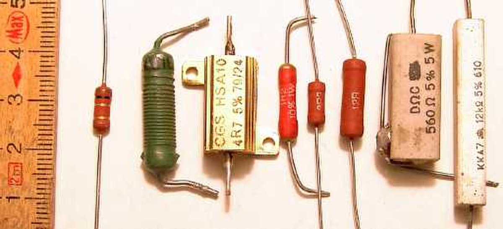
    

   

### Définition

Les **résistances** sont des composants passifs utilisés pour limiter le courant dans un circuit. Elles convertissent l'énergie électrique en chaleur, jouant ainsi un rôle clé dans la régulation de la tension et du courant dans les circuits.

### Fonctionnement

La résistance limite le flux de courant en s'opposant à son passage. La loi d'Ohm, qui relie la tension (V), le courant (I) et la résistance (R), s'exprime par la formule suivante :

`V = I × R`

### Types de Résistances

1. **Résistances fixes** :

   

    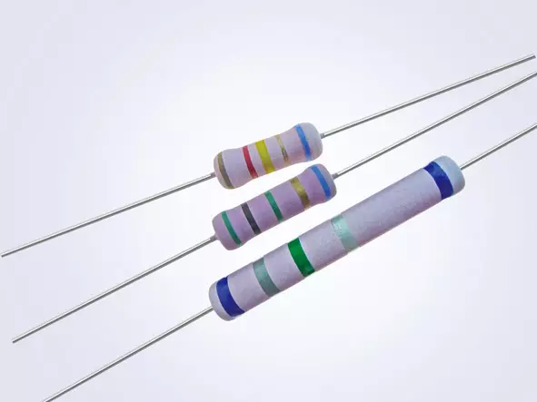
    

   

   - Valeur de résistance constante.
   - Utilisées pour des applications standard où la valeur n'est pas sujette à changement.

2. **Résistances variables (potentiomètres)** :

   

    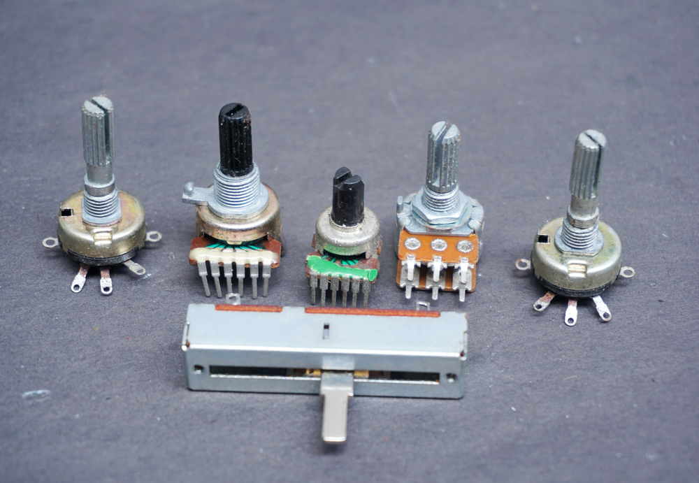
    

   

   - Valeur ajustable, souvent utilisée pour des réglages comme le volume d'un appareil audio.
   - Types courants : potentiomètres linéaires et logarithmiques.

3. **Résistances de puissance** :

   

    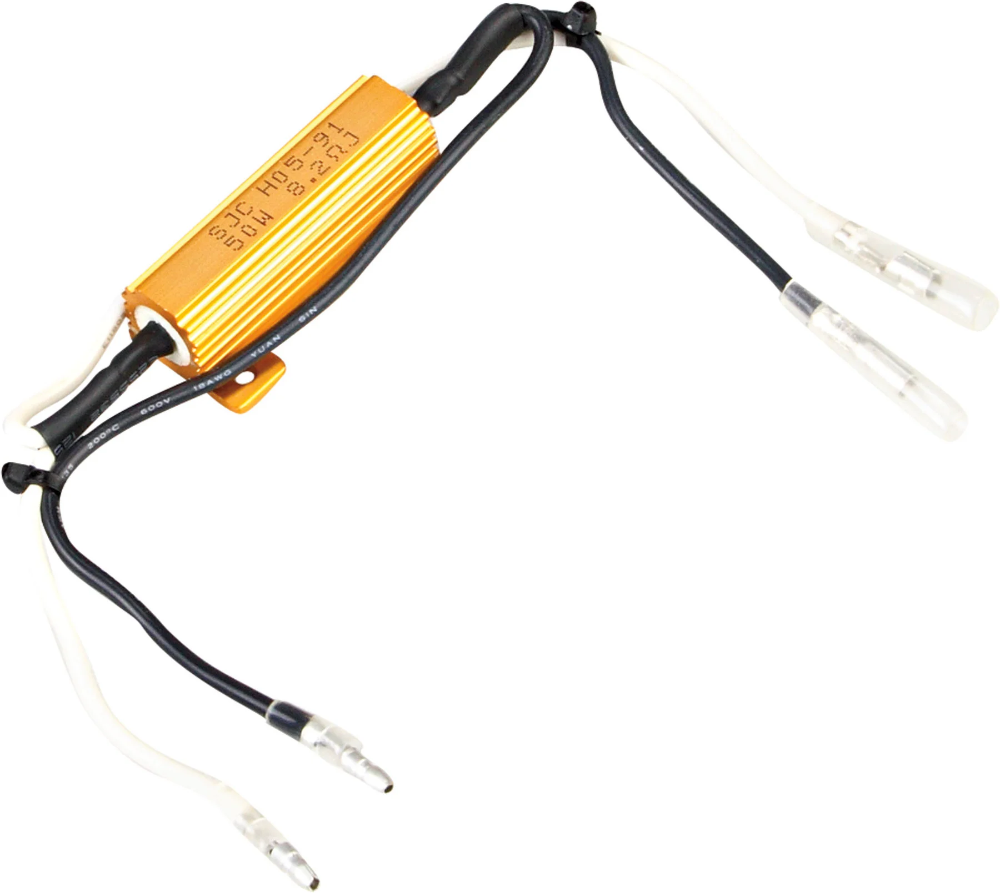
    

   

   - Conçues pour dissiper de grandes quantités d'énergie.
   - Utilisées dans les applications où le courant peut atteindre des valeurs élevées.

### Applications

- **Limitation du courant** : Protège les circuits sensibles contre les surcharges.
- **Réglage de la tension** : Assure une tension appropriée pour les composants en aval.
- **Diviseurs de tension** : Permettent d'obtenir des tensions spécifiques dans un circuit.

---

## 3.2 Condensateurs

   

    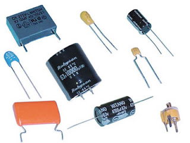
    

   

### Définition

Les **condensateurs** sont des composants passifs qui stockent de l'énergie électrique sous forme de champ électrique. Ils sont constitués de deux plaques conductrices séparées par un isolant (diélectrique).

### Fonctionnement

Lorsqu'une tension est appliquée, le condensateur accumule des charges positives et négatives sur ses plaques, créant un champ électrique. La capacité (C) d'un condensateur, mesurée en farads (F), est calculée par la relation :

`C = Q / V`

Où :

- C est la capacité (en farads),
- Q est la charge (en coulombs),
- V est la tension (en volts).

### Types de Condensateurs

1. **Condensateurs électrolytiques** :

   

    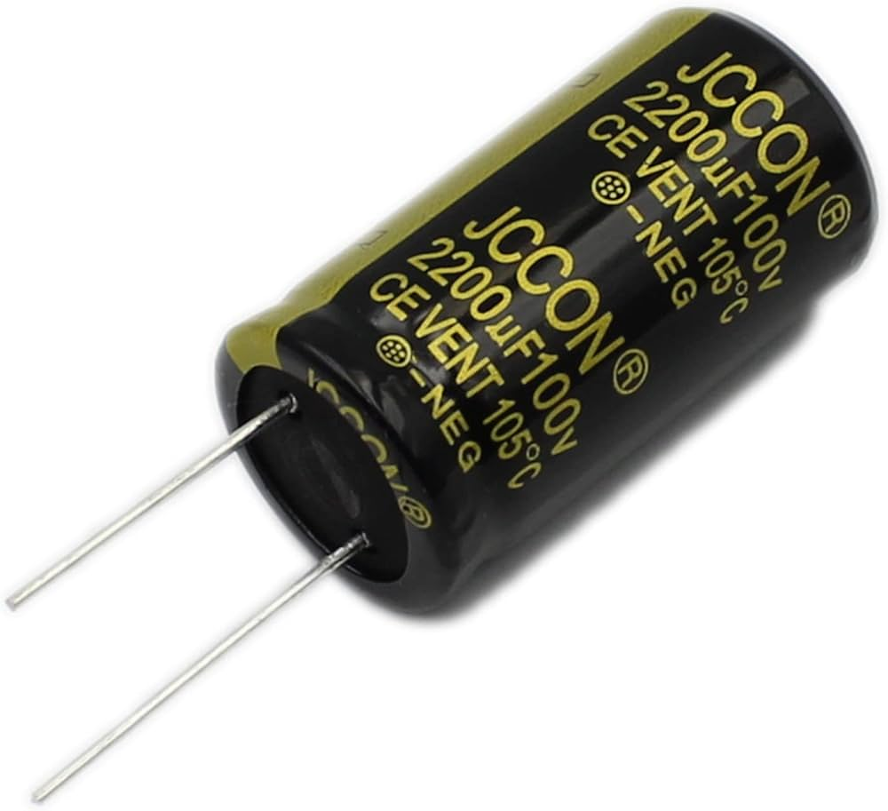
    

   

   - Polaires, utilisés pour des applications à faible fréquence.
   - Grande capacité dans un petit volume.

2. **Condensateurs céramiques** :

   

    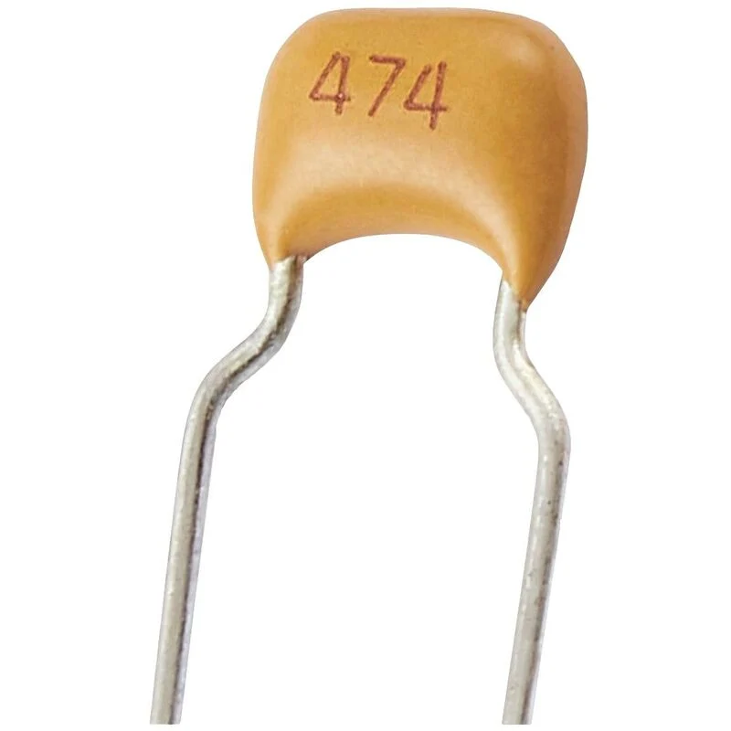
    

   

   - Non polaires, adaptés à des applications à haute fréquence.
   - Généralement de petite taille et bon pour les filtrages haute fréquence.

3. **Condensateurs à film** :

   

    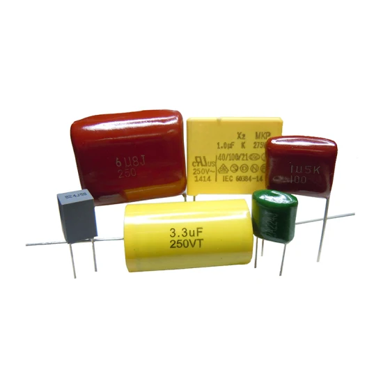
    

   

   - Utilisés dans des applications de précision.
   - Haute stabilité et faible perte, souvent utilisés dans les circuits audio.

### Applications

- **Filtrage** : Utilisés dans les alimentations pour réduire les fluctuations de tension.
- **Stockage d'énergie** : Fournissent une courte impulsion de courant, comme dans les flashs d'appareils photo.
- **Couplage et découplage** : Éliminent les interférences entre différents étages d'un amplificateur.

---

## 3.3 Inductances

   

    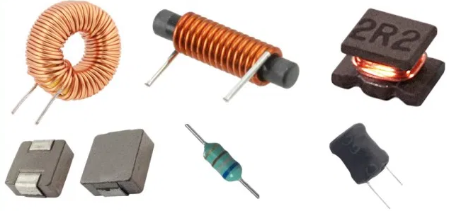
    

   

### Définition

Les **inductances** sont des composants qui stockent de l'énergie sous forme de champ magnétique. Elles sont généralement constituées de fil conducteur enroulé en bobine.

### Fonctionnement

Lorsque le courant traverse une inductance, un champ magnétique se forme autour de la bobine. La tension (V) aux bornes d'une inductance est liée à la variation du courant (I) dans le temps (t) par la formule :

`V = L × (dI/dt)`

Où :

- V est la tension (en volts),
- L est l'inductance (en henrys),
- dI/dt est la variation du courant par rapport au temps.

### Types d'Inductances

1. **Inductances à air** :

   

    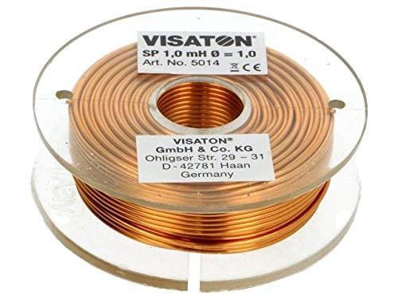
    

   

   - N'ont pas de noyau magnétique.
   - Utilisées pour des fréquences élevées, généralement dans les circuits RF.

2. **Inductances noyées** :

   

    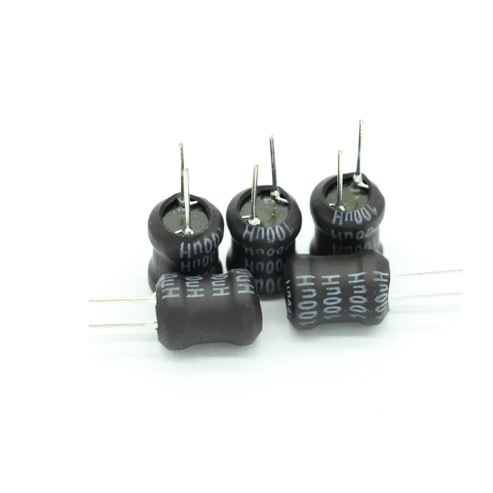
    

   

   - Contiennent un noyau magnétique pour augmenter l'inductance.
   - Utilisées dans des applications de faible fréquence.

3. **Transformateurs** :

   

    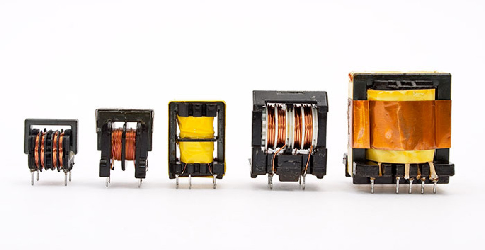
    

   

   - Utilisés pour transférer de l'énergie entre circuits à différents niveaux de tension.
   - Basés sur le principe d'induction électromagnétique.

### Applications

- **Filtrage** : Utilisées dans les circuits d'alimentation pour lisser la sortie.
- **Circuits oscillants** : Associées à des condensateurs pour créer des circuits résonants.
- **Stockage d'énergie** : Dans les alimentations à découpage, où elles sont utilisées pour conserver l'énergie.

---

## 3.4 Diodes

   

    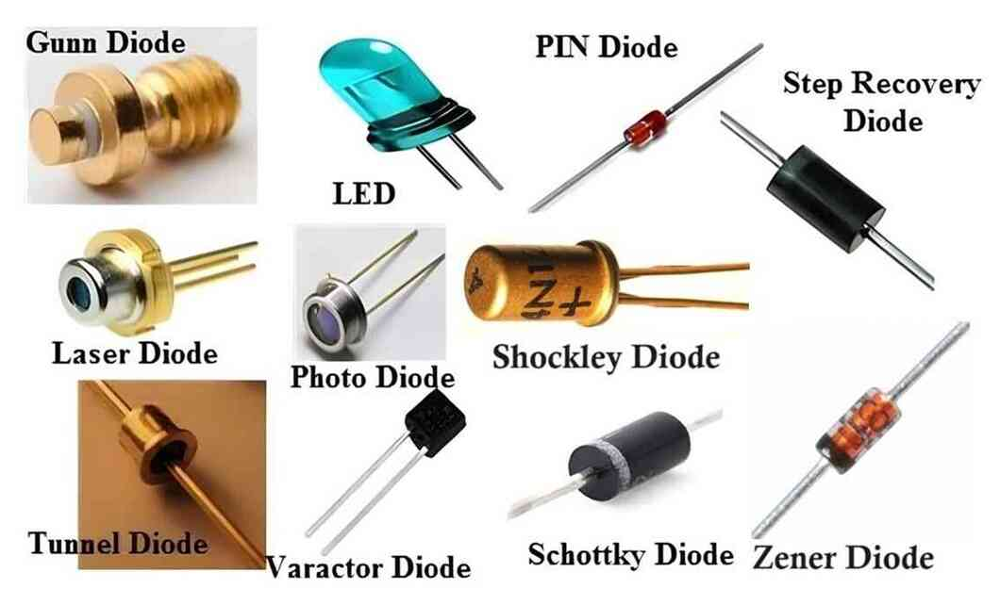
    

   

### Définition

Les **diodes** sont des composants semi-conducteurs qui permettent au courant de circuler dans une seule direction. Elles sont essentielles pour la conversion de courant alternatif (CA) en courant continu (CC).

### Fonctionnement

En polarisation directe (tension positive sur l'anode et négative sur la cathode), la diode laisse passer le courant. En polarisation inverse, elle bloque le courant. Cela permet aux diodes d'agir comme des interrupteurs.

### Types de Diodes

1. **Diodes standard** :

   

    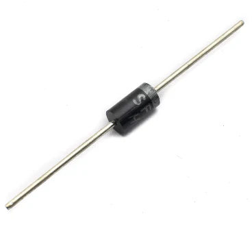
    

   

   - Utilisées pour le redressement du courant.
   - Généralement utilisées dans les alimentations.

2. **Diodes Zener** :

   

    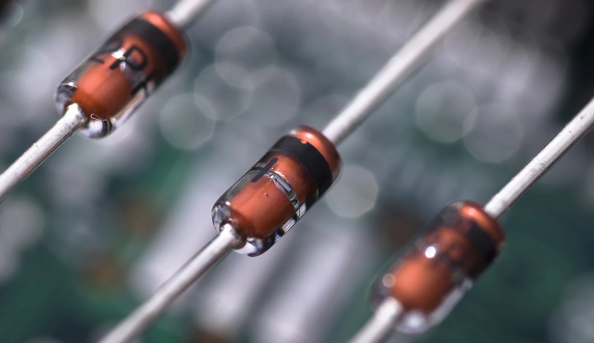
    

   

   - Permettent un passage de courant en polarisation inverse à une tension spécifique.
   - Utilisées pour la régulation de tension dans des circuits.

3. **Diodes Schottky** :

   

    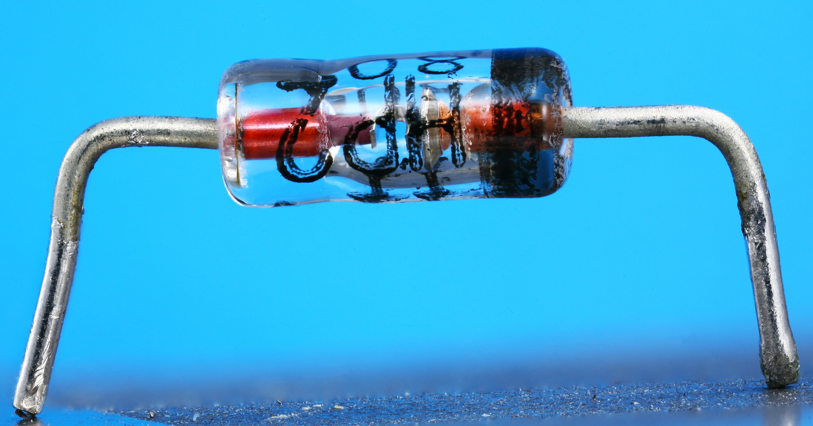
    

   

   - Ont une faible tension de seuil et un temps de commutation rapide.
   - Idéales pour des applications à haute fréquence et faible perte.

### Applications

- **Redressement** : Convertissent le courant CA en CC dans les alimentations.
- **Protection** : Évitent les surtensions dans les circuits sensibles.
- **Circuits de détection de signal** : Utilisées pour identifier des signaux faibles dans les récepteurs radio.

---

## 3.5 Transistors

   

    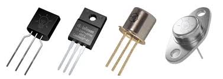
    

   

### Définition

Les **transistors** sont des composants semi-conducteurs capables d'amplifier ou de commuter des signaux électroniques. Ils sont la base des circuits logiques et des appareils électroniques modernes.

### Fonctionnement

Les transistors peuvent fonctionner comme des interrupteurs ou des amplificateurs. Dans un transistor bipolaire (BJT), le courant de base contrôle le courant entre le collecteur et l'émetteur. Dans un transistor à effet de champ (FET), la tension de grille contrôle le courant entre le drain et la source.

### Types de Transistors

1. **Transistors bipolaires (BJT)** :

   

    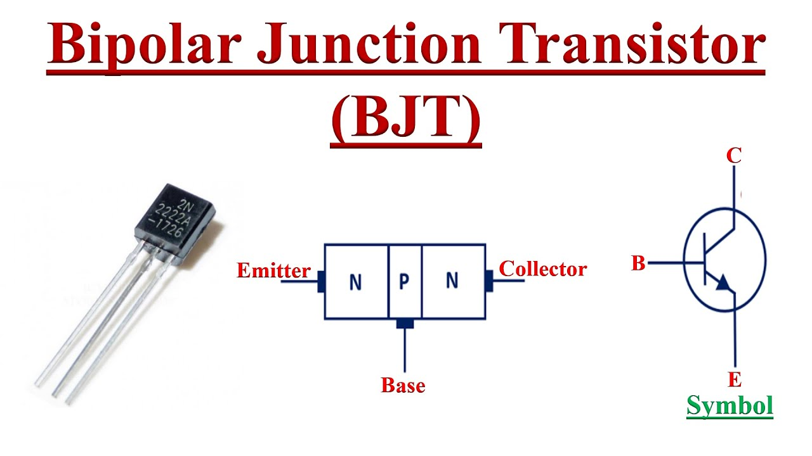
    

   

   - Utilisés pour l'amplification des signaux.
   - Bon pour les applications nécessitant un gain élevé.

2. **Transistors à effet de champ (FET)** :

   

    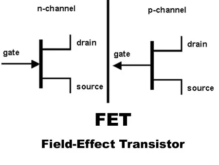
    

   

   - Utilisés pour des applications à haute impédance.
   - Plus sensibles à la tension, moins affectés par le courant.

3. **Transistors MOSFET** :

   

    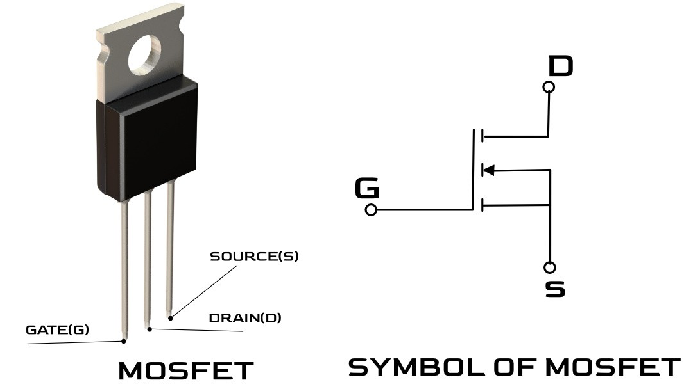
    

   

   - Très populaires dans les circuits numériques et de puissance.
   - Offrent une commutation rapide et une faible consommation d'énergie.

### Applications

- **Amplification** : Utilisés dans les amplificateurs audio pour augmenter le signal.
- **Commutation** : Fondamentaux dans les circuits numériques, comme les microprocesseurs.
- **Circuits intégrés** : Permettent l'intégration de milliers, voire de millions de transistors sur une seule puce pour créer des dispositifs complexes comme les ordinateurs et smartphones.

---

Ces composants de base sont fondamentaux pour la conception et la compréhension des circuits électroniques. Chacun d'eux joue un rôle spécifique et essentiel, contribuant à la fonctionnalité globale d'un système électronique. 