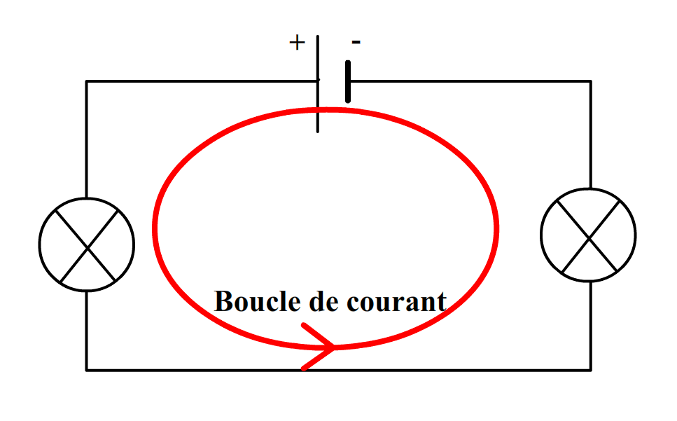
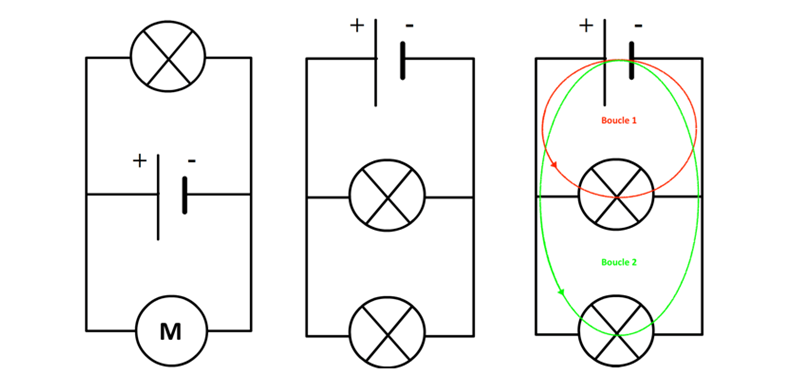
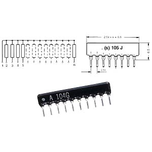
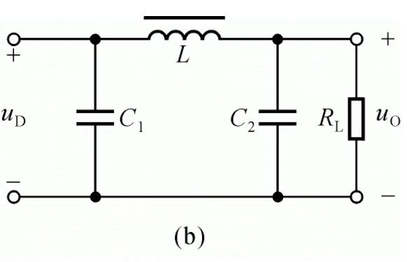
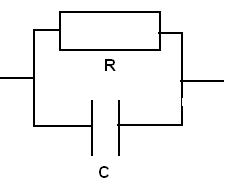
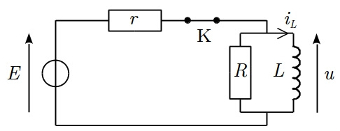
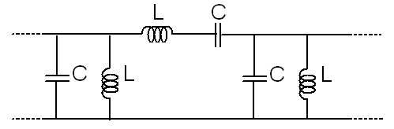

# 4. Circuits Électroniques de Base

## 4.1 Circuits en Série et en Parallèle

### Circuits en Série

   

    
    

   

#### Définition

Un circuit en série est un type de circuit où tous les composants sont connectés les uns après les autres, formant un seul chemin pour le courant. Le même courant circule à travers chaque composant.

#### Caractéristiques

- **Courant** : Le courant (I) est identique à travers chaque élément du circuit, c’est-à-dire :
  
`I_total = I_1 = I_2 = ... = I_n`

- **Tension** : La tension totale (V_total) dans le circuit est la somme des tensions à travers chaque résistance :

`V_total = V_1 + V_2 + ... + V_n`

- **Résistance équivalente** : La résistance totale (R_total) est la somme des résistances individuelles :

`R_total = R_1 + R_2 + ... + R_n`

#### Avantages et Inconvénients

- **Avantages** :

- Simplicité dans la conception et l'analyse.
- Facilité d'installation : les composants sont simplement reliés.

- **Inconvénients** :

- Si un composant échoue (par exemple, une résistance brûlée), le courant est interrompu dans tout le circuit.
- Une augmentation de la résistance totale entraîne une diminution du courant dans le circuit.

#### Exemples de Circuits en Série

- **Lumières de Noël** : Les ampoules sont souvent connectées en série, ce qui signifie que si une ampoule brûle, toutes s'éteignent.
- **Circuits de batteries** : Les batteries peuvent être connectées en série pour augmenter la tension totale disponible.

---

### Circuits en Parallèle

   

    
    

   

#### Définition

Un circuit en parallèle est un type de circuit où les composants sont connectés aux mêmes bornes, formant plusieurs chemins pour le courant. Le courant peut se diviser entre plusieurs branches.

#### Caractéristiques

- **Courant** : Le courant total (I_total) est la somme des courants passant par chaque branche :

`I_total = I_1 + I_2 + ... + I_n`

- **Tension** : La tension (V) aux bornes de chaque composant est la même :

`V_total = V_1 = V_2 = ... = V_n`

- **Résistance équivalente** : La résistance totale (R_total) d'un circuit en parallèle est donnée par :

`1/R_total = 1/R_1 + 1/R_2 + ... + 1/R_n`

ou, pour deux résistances :

`R_total = (R_1 * R_2) / (R_1 + R_2)`

#### Avantages et Inconvénients

- **Avantages** :

- Si un composant échoue, les autres continuent à fonctionner.
- La tension reste constante sur chaque composant.

- **Inconvénients** :

- Plus complexe à concevoir et à analyser que les circuits en série.
- Peut consommer plus de courant total.

#### Exemples de Circuits en Parallèle

- **Prises électriques** : Les appareils sont souvent branchés en parallèle pour qu'ils puissent fonctionner indépendamment.
- **Circuits d'éclairage** : Dans une maison, les lampes sont généralement câblées en parallèle pour que chacune puisse être contrôlée individuellement.

---

## 4.2 Réseaux de Résistances

   

    
    

   

### Définition

Les réseaux de résistances sont des arrangements de résistances qui permettent de diviser la tension ou le courant dans un circuit. Ils peuvent être configurés en série, en parallèle ou en combinaisons des deux.

### Utilisation des Réseaux de Résistances

#### Diviseur de Tension

Un diviseur de tension est un circuit composé de deux résistances en série qui permet de réduire la tension à un niveau désiré. La tension de sortie (V_out) est calculée comme suit :

`V_out = V_in × (R_2 / (R_1 + R_2))`

- **V_out** : Tension de sortie souhaitée.
- **V_in** : Tension d'entrée appliquée.
- **R_1 et R_2** : Valeurs des résistances.

**Exemple** : Si `V_in = 12V`, `R_1 = 4Ω`, et `R_2 = 6Ω`, alors :

`V_out = 12 × (6 / (4 + 6)) = 12 × 0.6 = 7.2V`

#### Diviseur de Courant

Un diviseur de courant est utilisé dans un circuit en parallèle pour diviser le courant entre plusieurs résistances. Le courant à travers une résistance est donné par :

`I_n = I_total × (R_total / R_n)`

- **I_n** : Courant à travers la résistance n.
- **I_total** : Courant total dans le circuit.
- **R_total** : Résistance équivalente du circuit.
- **R_n** : Valeur de la résistance n.

### Applications

- **Contrôle de la tension** : Ajuste la tension pour des composants spécifiques.
- **Protection** : Évite que des composants sensibles reçoivent trop de courant.
- **Mesure** : Utilisé dans des circuits de mesure pour obtenir des tensions de référence, comme dans les ponts de Wheatstone.

---

## 4.3 Filtres (RC, RL, LC)

   

    
    

   

### Définition

Les **filtres** sont des circuits qui permettent de sélectionner ou de rejeter certaines fréquences. Ils sont couramment utilisés dans les applications de traitement du signal, audio et de communication.

### Types de Filtres

#### 1. Filtres RC

   

    
    

   

Un filtre RC est constitué d'une résistance (R) et d'un condensateur (C). Il peut être configuré comme un filtre passe-bas ou passe-haut.

- **Filtre Passe-Bas** : Laisse passer les basses fréquences et atténue les hautes fréquences. La fréquence de coupure (f_c) est donnée par :

`f_c = 1 / (2πRC)`

- **Filtre Passe-Haut** : Laisse passer les hautes fréquences et atténue les basses fréquences. La fréquence de coupure est calculée de la même manière.

#### 2. Filtres RL

   

    
    

   

Un filtre RL est composé d'une résistance (R) et d'une inductance (L). Il peut également être configuré en passe-bas ou passe-haut.

- **Filtre Passe-Bas** : Laisse passer les basses fréquences. La fréquence de coupure est :

`f_c = R / (2πL)`

- **Filtre Passe-Haut** : Laisse passer les hautes fréquences, avec la fréquence de coupure donnée par :

`f_c = R / (2πL)`

#### 3. Filtres LC

   

    
    

   

Un filtre LC est constitué d'une inductance (L) et d'un condensateur (C). Ces filtres sont très efficaces pour la sélection de fréquences.

- **Filtre Passe-Bas** : Laisse passer les basses fréquences. Sa fréquence de coupure est :

`f_c = 1 / (2π√(LC))`

- **Filtre Passe-Haut** : Laisse passer les hautes fréquences avec la même formule de fréquence de coupure.

### Applications

- **Traitement du signal** : Élimination des bruits indésirables dans les signaux audio.
- **Communications** : Sélection des bandes de fréquences dans les transmissions radio.
- **Électronique audio** : Amélioration de la qualité sonore en filtrant certaines fréquences.

### Conclusion

Les circuits en série et en parallèle, ainsi que les réseaux de résistances et les filtres, sont des concepts fondamentaux en électronique. Une bonne compréhension de ces concepts est essentielle pour la conception, l'analyse et le dépannage des circuits électroniques modernes.