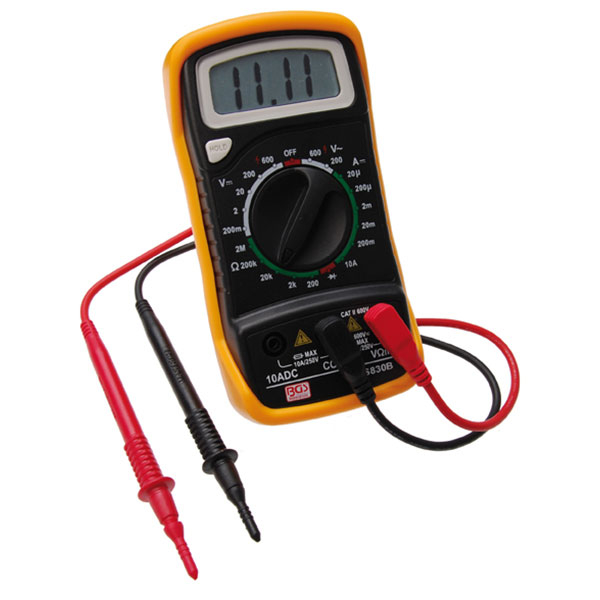
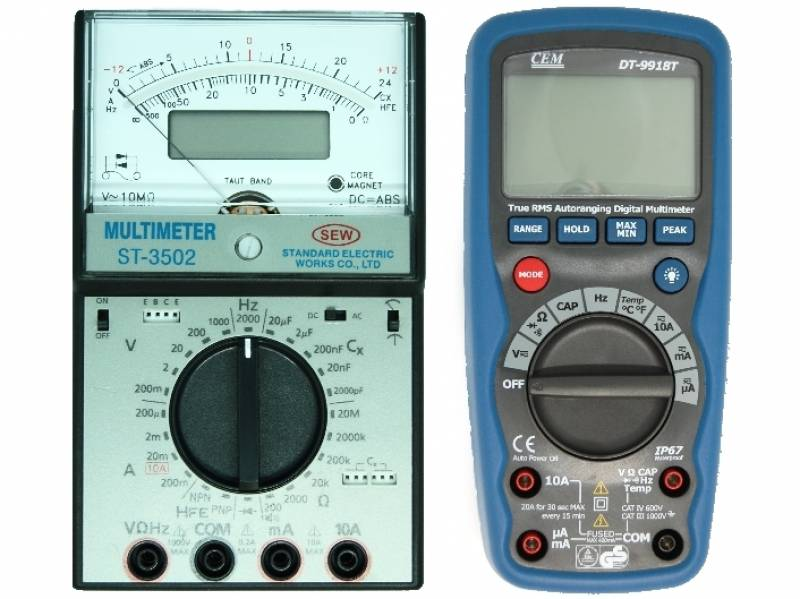
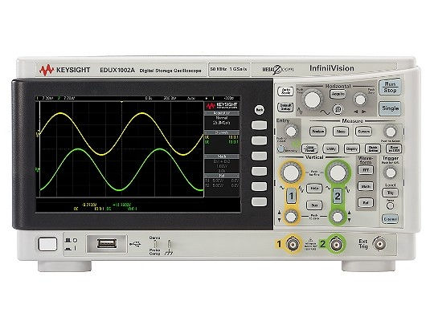
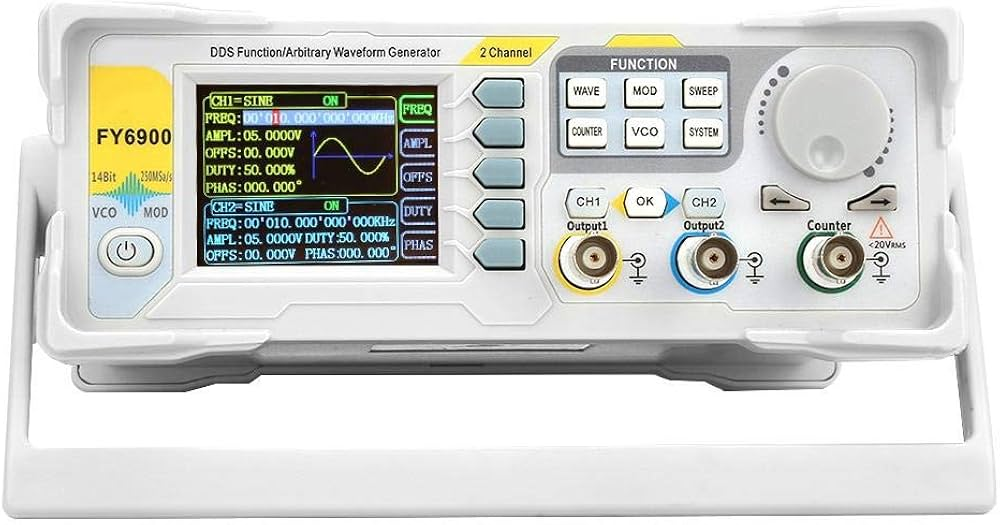

# 5. Mesure des Grandeurs Électriques

La mesure des grandeurs électriques est fondamentale dans le domaine de l'électronique. Cela permet de diagnostiquer et d'analyser les circuits en quantifiant des paramètres essentiels tels que la tension, le courant et la résistance. Dans cette section, nous allons explorer en détail trois instruments de mesure courants : le multimètre, l'oscilloscope et le générateur de signal.

## 5.1 Multimètre

   

    
    

   

### 5.1.1 Définition

Un multimètre est un appareil de mesure polyvalent qui peut mesurer plusieurs grandeurs électriques, notamment :

- Tension (en volts)
- Courant (en ampères)
- Résistance (en ohms)

### 5.1.2 Types de Multimètres

   

    
    

   

- **Analogiques** : Ces multimètres utilisent un cadran avec une aiguille pour afficher les mesures. Ils peuvent être plus sensibles à des variations lentes.
  
- **Numériques** : Ils affichent les mesures sous forme numérique, ce qui permet une lecture plus claire et une plus grande précision. Ils incluent souvent des fonctionnalités avancées telles que la mesure de la fréquence et la capacité.

### 5.1.3 Fonctionnalités

1. **Mesure de la Tension (V)**

   - **Courant Continu (DC)** : Mesure de la tension dans des circuits alimentés par une source de courant continu, comme une batterie.
   - **Courant Alternatif (AC)** : Mesure de la tension dans des circuits alimentés par une source de courant alternatif, comme le secteur électrique.

   **Exemple d'utilisation** :

   Pour mesurer la tension d'une batterie de 9V :

   - Réglez le multimètre en mode DC.
   - Connectez les sondes aux bornes de la batterie.
   - Lisez la valeur affichée.

2. **Mesure du Courant (I)**

   - Pour mesurer le courant, le multimètre doit être connecté en série dans le circuit, ce qui implique de couper le circuit à un point et d'insérer le multimètre.

   **Exemple d'utilisation** :

   Pour mesurer le courant dans une ampoule :

   - Éteignez le circuit et déconnectez un des fils de l'ampoule.
   - Connectez le multimètre en mode ampèremètre en série.
   - Rallumez le circuit et lisez la valeur affichée.

3. **Mesure de la Résistance (R)**

   - Lorsqu'il est configuré en mode ohmmètre, le multimètre envoie un courant à travers la résistance et mesure la chute de tension. La résistance est ensuite calculée selon la loi d'Ohm, qui est :

   `Résistance (R) = Tension (V) / Courant (I)`

   **Exemple d'utilisation** :
   
   Pour mesurer une résistance de `100Ω` :
   
   - Débranchez la résistance du circuit.
   - Réglez le multimètre en mode ohmmètre.
   - Connectez les sondes aux bornes de la résistance et lisez la valeur affichée.

### 5.1.4 Avantages et Limitations

- **Avantages** :

  - **Polyvalence** : Un seul appareil peut mesurer plusieurs grandeurs.
  - **Portabilité** : Généralement léger et facile à transporter.

- **Limitations** :

  - **Mesure des signaux rapides** : Un multimètre ne peut pas mesurer des signaux qui varient rapidement, comme ceux de certains circuits numériques.
  - **Précision** : La précision varie selon le modèle et la qualité de l'appareil.

---

## 5.2 Oscilloscope

   

    
    

   

### 5.2.1 Définition

L'oscilloscope est un instrument qui permet de visualiser les signaux électriques sous forme d'ondes. Il représente la tension (en volts) en fonction du temps (en secondes), ce qui permet d'analyser la forme d'onde d'un signal.

### 5.2.2 Fonctionnalités

- **Visualisation des Signaux** : L'oscilloscope affiche des signaux électriques, permettant d'observer des caractéristiques telles que la forme, l'amplitude et la fréquence.
  
- **Mesures de Temps** : L'instrument peut mesurer la période (T) d'un signal, qui est l'inverse de la fréquence (f) :

  `Fréquence (f) = 1 / Période (T)`

- **Analyse de la Forme d'Onde** : Permet de détecter des anomalies comme les distorsions, les pics, le bruit et les fluctuations.

### 5.2.3 Types d'Oscilloscopes

- **Oscilloscopes Analogiques** : Utilisent des tubes cathodiques pour afficher les signaux. Moins courants aujourd'hui en raison de la prévalence des oscilloscopes numériques.

- **Oscilloscopes Numériques** : Échantillonnent les signaux avec des convertisseurs analogique-numérique (CAN), offrant une plus grande précision et des fonctionnalités avancées (comme le stockage de données et des mesures automatiques).

### 5.2.4 Applications

- **Débogage de Circuits** : Utilisé pour visualiser les signaux à différents points d'un circuit afin d'identifier les problèmes.
  
- **Analyse de Signaux** : Essentiel dans les domaines de l'audio, de la communication, et des systèmes embarqués pour évaluer la qualité des signaux.

- **Mesures de Transitoires** : Utile pour observer les réponses temporaires d'un circuit après un changement d'état (comme l'allumage d'un appareil).

### 5.2.5 Avantages et Limitations

- **Avantages** :

  - **Visualisation en temps réel** : Permet d'observer la dynamique des signaux.
  - **Analyse de signaux complexes** : Capable de gérer plusieurs canaux simultanément.

- **Limitations** :

  - **Coût** : Plus coûteux qu'un multimètre simple.
  - **Complexité d'utilisation** : Nécessite une formation pour interpréter correctement les résultats.

---

## 5.3 Générateur de Signal

   

    
    

   

### 5.3.1 Définition

Un générateur de signal est un appareil qui produit des signaux électriques de différentes formes d'onde, comme des signaux sinusoïdaux, carrés, triangulaires ou en dents de scie. Il est utilisé principalement pour tester et analyser les circuits électroniques.

### 5.3.2 Fonctionnalités

- **Types de Signaux** : Peut produire des signaux à fréquence variable, y compris des signaux continus (DC) et alternatifs (AC).
  
- **Contrôle de l'Amplitude** : Permet de régler l'amplitude du signal pour simuler différentes conditions de fonctionnement.

- **Fréquence Variable** : Possibilité de régler la fréquence du signal de test pour s'adapter aux besoins du circuit à tester.

### 5.3.3 Types de Générateurs de Signal

- **Générateurs de Fonction** : Produisent des signaux de différentes formes d'onde (sinusoïdales, carrées, triangulaires) avec un contrôle sur la fréquence et l'amplitude.
  
- **Générateurs de Fréquence** : Conçus pour fournir des signaux à des fréquences spécifiques.

### 5.3.4 Applications

- **Tests de Circuits** : Fournit des signaux de référence pour tester la réponse d'un circuit à une fréquence spécifique.
  
- **Systèmes de Communication** : Simule des signaux de transmission pour évaluer les performances des systèmes de communication.

- **Éducation** : Utilisé dans les laboratoires pour enseigner les concepts d'électronique et de traitement du signal.

### 5.3.5 Avantages et Limitations

- **Avantages** :

  - **Flexibilité** : Peut simuler une large gamme de signaux pour différents tests.
  - **Utilité en R&D** : Essentiel pour le développement de nouveaux circuits.

- **Limitations** :

  - **Coût** : Les générateurs de signal avancés peuvent être coûteux.
  - **Pas de mesures** : Ne fournit pas de mesures mais uniquement des signaux.

---

## Conclusion

La mesure des grandeurs électriques est une compétence essentielle en électronique. Les instruments tels que le multimètre, l'oscilloscope et le générateur de signal jouent un rôle crucial dans l'analyse et le diagnostic des circuits électroniques. La compréhension de leurs fonctionnalités, de leurs avantages et de leurs limitations est essentielle pour tout technicien ou ingénieur en électronique.
